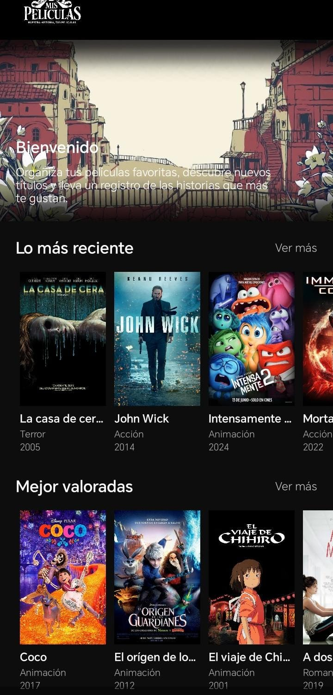
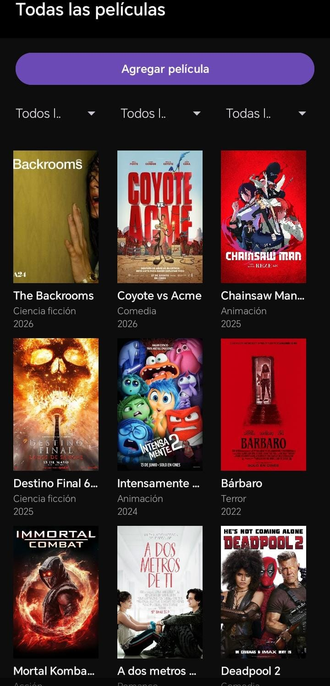
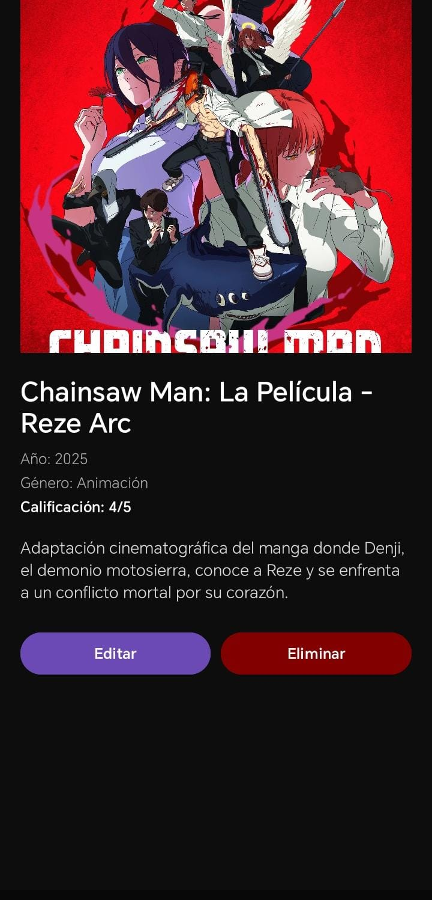
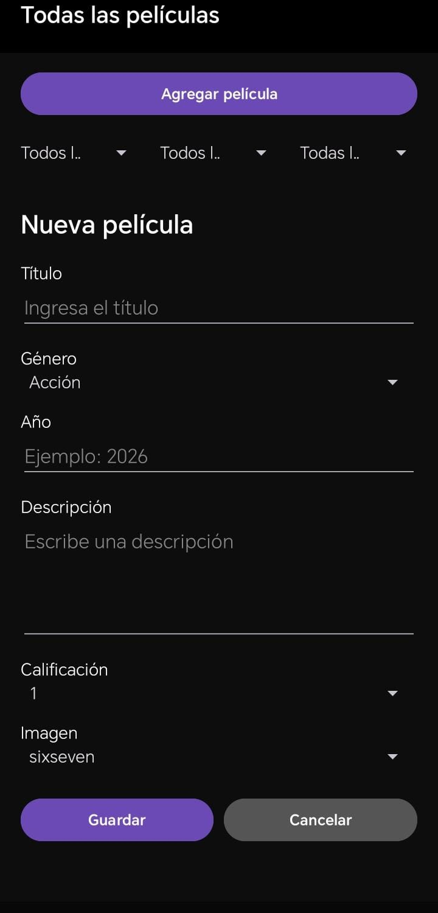

# 🎬 Mis Películas

Aplicación móvil desarrollada en **Android Studio** como proyecto académico, orientada a la gestión y organización de una colección personal de películas.

La aplicación permite visualizar una colección de películas, consultar información detallada, registrar nuevos títulos, editar y eliminar películas, además de ordenar y filtrar el contenido disponible.

---

## 📖 Descripción del proyecto

**Mis Películas** es una aplicación Android que permite al usuario gestionar una colección de películas desde una interfaz sencilla e intuitiva.

Cada película contiene información como:

* 🎬 Título
* 🎭 Género
* 📅 Año
* 📝 Descripción
* ⭐ Calificación
* 🖼️ Imagen

La información de las películas se gestiona mediante una base de datos **SQLite**, mientras que las películas se presentan utilizando componentes de Android como **RecyclerView**.

La aplicación también incluye imágenes almacenadas dentro del propio proyecto, permitiendo utilizarlas al momento de registrar una película.

---

## 🎯 Objetivo

El objetivo del proyecto es desarrollar una aplicación móvil que permita gestionar una colección de películas mediante operaciones básicas de registro, consulta, edición y eliminación.

Además, el proyecto permite aplicar conceptos relacionados con:

* Desarrollo de aplicaciones Android.
* Programación orientada a objetos con Java.
* Persistencia de datos mediante SQLite.
* Uso de RecyclerView.
* Manejo de Activities y Fragments.
* Diseño de interfaces mediante layouts XML.
* Organización de recursos dentro de un proyecto Android.

---

## ✨ Funcionalidades

La aplicación cuenta con las siguientes funcionalidades:

| Funcionalidad            | Descripción                                                                               |
| ------------------------ | ----------------------------------------------------------------------------------------- |
| 🎬 Visualizar películas  | Permite visualizar las películas disponibles en la colección.                             |
| 🔎 Ver detalles          | Permite consultar la información completa de una película.                                |
| ➕ Agregar películas      | Permite registrar nuevas películas en la colección.                                       |
| ✏️ Editar películas      | Permite modificar la información de una película existente.                               |
| 🗑️ Eliminar películas   | Permite eliminar una película de la colección.                                            |
| 🔃 Ordenar y filtrar     | Permite organizar las películas disponibles mediante opciones de ordenamiento y filtrado. |
| 🖼️ Seleccionar imágenes | Permite utilizar imágenes de películas almacenadas dentro del proyecto.                   |

> **Nota:** Actualmente la aplicación no cuenta con una función de búsqueda por texto.

---

## 🔄 Flujo general de la aplicación

El funcionamiento general de la aplicación puede resumirse de la siguiente manera:

```text
                    ┌──────────────────┐
                    │  SplashActivity  │
                    └────────┬─────────┘
                             │
                             ▼
                    ┌──────────────────┐
                    │   Pantalla       │
                    │    principal     │
                    └────────┬─────────┘
                             │
              ┌──────────────┼──────────────┐
              │              │              │
              ▼              ▼              ▼
        ┌───────────┐  ┌────────────┐  ┌──────────────┐
        │ Películas │  │ Agregar /  │  │ Ordenar /    │
        │           │  │ Editar     │  │ Filtrar      │
        └─────┬─────┘  └──────┬─────┘  └──────────────┘
              │               │
              ▼               ▼
       ┌─────────────┐  ┌─────────────┐
       │   Detalle   │  │   SQLite    │
       │ película    │  │  Database   │
       └─────────────┘  └─────────────┘
```

El usuario puede navegar por las películas disponibles, consultar sus detalles o acceder al formulario para registrar y modificar información.

---

## 📱 Pantallas de la aplicación

### 🏠 Pantalla de inicio

Al iniciar la aplicación se muestra una pantalla de bienvenida con el logotipo de **Mis Películas**.

<p align="center">
  
</p>

### 🏡 Pantalla principal

La pantalla principal da la bienvenida al usuario y presenta diferentes carruseles para explorar el contenido disponible.

<p align="center">
  
</p>

### 🎞️ Lista de películas

En esta sección se muestran las películas disponibles dentro de la aplicación mediante una interfaz basada en **RecyclerView**.

<p align="center">
  
</p>

### 🔎 Detalle de una película

Al seleccionar una película, el usuario puede acceder a su información detallada, incluyendo sus datos principales y la imagen correspondiente.

<p align="center">
  
</p>

### ➕ Agregar una película

La aplicación cuenta con un formulario que permite registrar una nueva película.

Desde este formulario se pueden ingresar los datos correspondientes al título, género, año, descripción, calificación e imagen.

<p align="center">
  
</p>

---

## 💾 Gestión de datos

La aplicación utiliza **SQLite** para gestionar la información de las películas.

La clase `DatabaseHelper` se encarga de gestionar la interacción con la base de datos utilizada por la aplicación.

Los datos almacenados corresponden a:

```text
Película
├── Título
├── Género
├── Año
├── Descripción
├── Calificación
└── Imagen
```

### 📌 Consideración sobre los datos

Al ejecutar el proyecto en un dispositivo o instalación nueva, la base de datos comienza sin películas registradas.

Esto significa que las películas agregadas anteriormente en otro dispositivo no aparecen automáticamente, ya que los datos almacenados en SQLite pertenecen a la instalación correspondiente.

Sin embargo, las imágenes incluidas dentro de `res/drawable` forman parte del proyecto y se encuentran disponibles para ser utilizadas al registrar películas.

---

## 🖼️ Imágenes de las películas

Las imágenes utilizadas por la aplicación se encuentran almacenadas dentro del proyecto, específicamente en:

```text
app/src/main/res/drawable/
```

De esta manera, los recursos gráficos forman parte de la aplicación y pueden utilizarse al registrar o gestionar las películas.

---

## 🎥 Demostración

Puedes ver una demostración del funcionamiento de la aplicación a continuación:

[▶️ Ver demostración de Mis Películas](docs/video/demostracion.mp4)

---

## 🛠️ Tecnologías utilizadas

El proyecto fue desarrollado utilizando las siguientes tecnologías y componentes:

| Tecnología / componente | Uso                                                          |
| ----------------------- | ------------------------------------------------------------ |
| ☕ **Java**              | Lenguaje principal utilizado para desarrollar la aplicación. |
| 📱 **Android**          | Plataforma para la aplicación móvil.                         |
| 🗄️ **SQLite**          | Gestión y persistencia de los datos de las películas.        |
| 📋 **RecyclerView**     | Presentación de las películas en listas.                     |
| 🧩 **Fragments**        | Organización de determinadas interfaces y formularios.       |
| 🎨 **XML**              | Diseño de las interfaces de usuario.                         |
| 🛠️ **Android Studio**  | Entorno de desarrollo utilizado.                             |
| 🔧 **Git**              | Control de versiones.                                        |
| 🌐 **GitHub**           | Almacenamiento y publicación del código fuente.              |

---

## 🧩 Componentes principales

El proyecto está organizado mediante diferentes clases Java, cada una con una responsabilidad dentro de la aplicación.

| Archivo                           | Función                                                           |
| --------------------------------- | ----------------------------------------------------------------- |
| `DatabaseHelper.java`             | Gestiona la base de datos SQLite utilizada por la aplicación.     |
| `DetallePeliculaActivity.java`    | Gestiona la visualización de los detalles de una película.        |
| `FormularioPeliculaFragment.java` | Contiene el formulario utilizado para agregar y editar películas. |
| `MainActivity.java`               | Gestiona la pantalla principal de la aplicación.                  |
| `Pelicula.java`                   | Representa la información de una película.                        |
| `PeliculaAdapter.java`            | Gestiona la presentación de las películas mediante RecyclerView.  |
| `SplashActivity.java`             | Gestiona la pantalla de inicio o bienvenida.                      |
| `VerMasPeliculasActivity.java`    | Gestiona la visualización de más películas disponibles.           |

---

## 📂 Estructura del proyecto

```text
Mispeliculas/
│
├── app/
│   └── src/
│       └── main/
│           │
│           ├── java/
│           │   └── ...
│           │       ├── DatabaseHelper.java
│           │       ├── DetallePeliculaActivity.java
│           │       ├── FormularioPeliculaFragment.java
│           │       ├── MainActivity.java
│           │       ├── Pelicula.java
│           │       ├── PeliculaAdapter.java
│           │       ├── SplashActivity.java
│           │       └── VerMasPeliculasActivity.java
│           │
│           └── res/
│               ├── drawable/
│               │   └── Imágenes de las películas
│               │
│               └── layout/
│                   ├── activity_detalle_pelicula.xml
│                   ├── activity_main.xml
│                   ├── activity_splash.xml
│                   ├── activity_ver_mas_peliculas.xml
│                   ├── fragment_formulario_pelicula.xml
│                   └── item_pelicula.xml
│
├── gradle/
├── docs/
│   ├── capturas/
│   │   ├── Inicio.jpg
│   │   ├── Principal.jpg
│   │   ├── Peliculas.jpg
│   │   ├── Detalle.jpg
│   │   └── Agregar.jpg
│   │
│   └── video/
│       └── demostracion.mp4
│
├── .gitignore
├── build.gradle.kts
├── gradle.properties
├── settings.gradle.kts
└── README.md
```

---

## 🚀 Instalación y ejecución

Para ejecutar el proyecto localmente, sigue los siguientes pasos.

### 1. Clonar el repositorio

```bash
git clone https://github.com/Dxf647/Mispeliculas.git
```

### 2. Abrir el proyecto

Abre **Android Studio** y selecciona la carpeta del proyecto `Mispeliculas`.

### 3. Sincronizar el proyecto

Espera a que Android Studio realice la sincronización de Gradle y termine de cargar las dependencias necesarias.

### 4. Ejecutar la aplicación

Puedes ejecutar la aplicación utilizando:

* Un dispositivo Android conectado al equipo.
* Un dispositivo virtual mediante el Android Emulator.

### 5. Probar la aplicación

Una vez iniciada la aplicación, puedes:

1. Explorar la pantalla principal.
2. Acceder a la lista de películas.
3. Consultar el detalle de una película.
4. Agregar una nueva película.
5. Seleccionar una imagen disponible en el proyecto.
6. Editar una película existente.
7. Eliminar una película.
8. Utilizar las opciones disponibles de ordenamiento y filtrado.

---

## 🧪 Verificación rápida

Para comprobar las principales funciones de la aplicación se puede realizar el siguiente flujo:

```text
Iniciar aplicación
       ↓
Visualizar pantalla principal
       ↓
Consultar películas
       ↓
Agregar una película
       ↓
Ver sus detalles
       ↓
Editar información
       ↓
Ordenar / filtrar películas
       ↓
Eliminar película
```

Este flujo permite comprobar las operaciones principales de gestión de la colección.

---

## 📚 Aprendizajes del proyecto

El desarrollo de **Mis Películas** permitió aplicar diferentes conceptos relacionados con el desarrollo de aplicaciones móviles, entre ellos:

* Desarrollo de interfaces para Android.
* Programación en Java.
* Manejo de Activities y Fragments.
* Implementación de listas mediante RecyclerView.
* Uso de adaptadores para mostrar información.
* Creación y utilización de una base de datos SQLite.
* Gestión de operaciones de registro, consulta, edición y eliminación.
* Organización de recursos gráficos y layouts.
* Control de versiones mediante Git.
* Publicación de proyectos mediante GitHub.

---

## 🎓 Proyecto académico

**Mis Películas** fue desarrollado como un proyecto académico para poner en práctica conocimientos de desarrollo de aplicaciones móviles y gestión de datos.

El proyecto integra una interfaz Android con una base de datos SQLite para permitir la gestión de una colección personal de películas.

---

<p align="center">
  🎬 <strong>Mis Películas</strong> · Organiza, descubre y disfruta tu colección.
</p>
